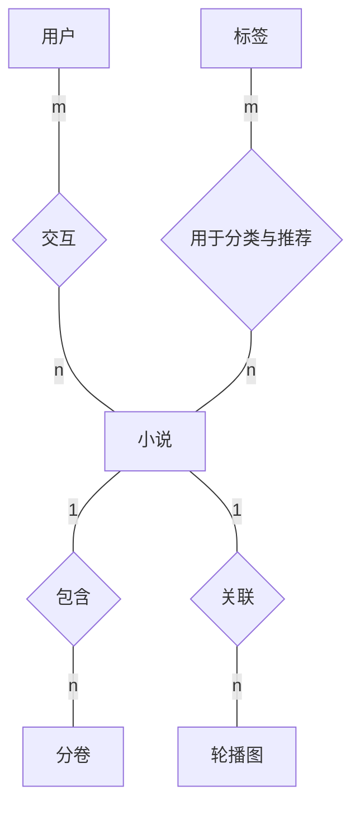

# 轻小说推荐系统 E-R 图（Chen 简版）

与参考图一致：**矩形**为实体、**菱形**为联系，线上标注 **1 / n / m**，**不展开属性**，只表达表与表之间的主干关系。

**库表对应**：用户→`user`，小说→`novel_book_main`，分卷→`novel_book_volume`，标签→`tag`，轮播图→`banner_carousel`。  
**交互**：收藏、评论、阅读历史、完读、不感兴趣等在实现上为多张表，图中合并为 **用户—小说** 的 **m:n**。  
**用于分类与推荐**：`tag` 与小说的标签在业务上对应（`novel_book_main.label` 等），库中无外键，图为**概念联系**。

---

## 图 1 Mermaid（矩形 + 菱形，[mermaid.live](https://mermaid.live) 可导出 PNG/SVG）



---

## 图 2 Graphviz 源文件

同结构已写入项目根目录 **`er_chen_novel_simple.dot`**。本机若已安装 Graphviz，可在项目目录执行：

```bash
dot -Tpng er_chen_novel_simple.dot -o er_chen_novel_simple.png
dot -Tsvg er_chen_novel_simple.dot -o er_chen_novel_simple.svg
```

导出图即可插入 Word；字体若乱码，可将 `.dot` 中 `fontname` 改为你机器上已有的中文字体名。

---

## 图 3 文本示意（与参考图同构，便于手画 / Visio）

```
                    m         交互         n
              ┌────────┐   ◇───────◇   ┌────────┐
              │  用户  │───────────────│  小说  │
              └────────┘               └───┬────┘
                                             │1
                                       包含  │n
                                             ▼
                                        ◇───────◇
                                             │
                                        ┌────┴────┐
                                        │  分卷   │
                                        └─────────┘

              ┌────────┐   1    关联    n   ┌────────┐
              │  小说  │◇───────────────◇│ 轮播图 │
              └────────┘                   └────────┘

                    m   用于分类与推荐   n
              ┌────────┐   ◇───────◇   ┌────────┐
              │  标签  │───────────────│  小说  │
              └────────┘               └────────┘
```

（上图为结构示意；实际排版可把「小说」只画一个矩形，多条菱形连线都接到同一「小说」框上。）
